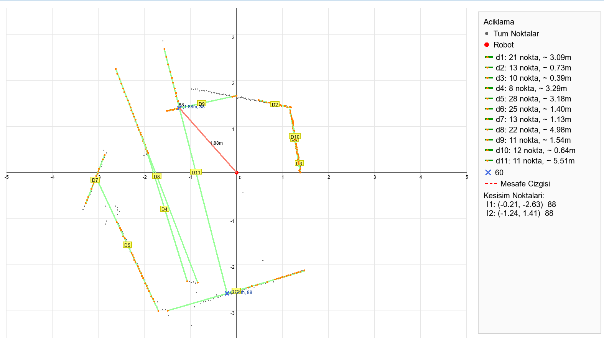
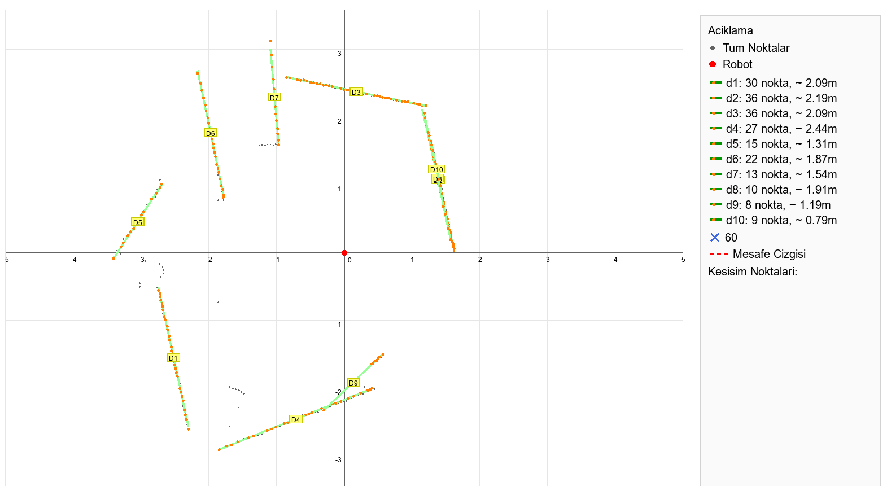
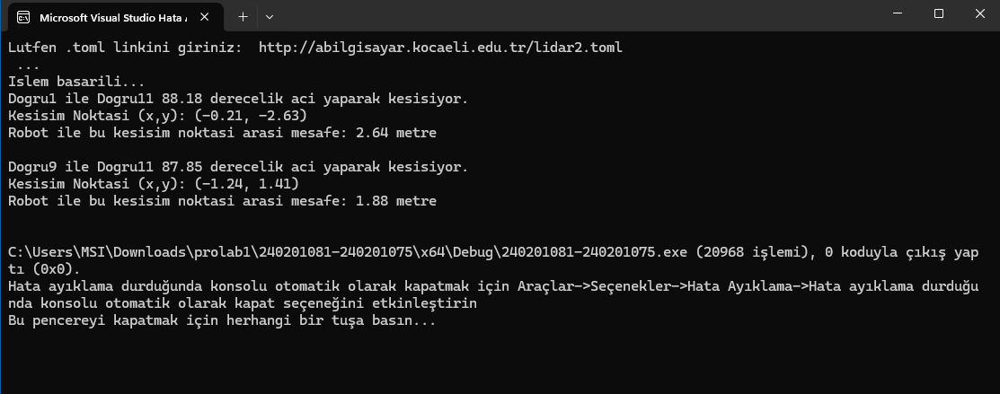

# LIDAR Doğru Tespiti ve Kesişim Analizi

Bu projede, TOML formatında verilen 2 boyutlu LIDAR verileri işlenerek nokta bulutu üzerinden doğru tespiti, kesişim analizi ve robot konumuna göre mesafe hesaplaması gerçekleştirilmiştir.

Filtrelenen ölçümler kutupsal koordinatlardan Kartezyen koordinatlara dönüştürülmüş, doğrusal nokta kümeleri belirlenmiş ve belirli bir açı eşiğini sağlayan doğru çiftlerinin kesişim noktaları hesaplanmıştır.

---

## Projenin Amacı

- TOML verilerini harici kütüphane kullanmadan okumak  
- Geçersiz ölçümleri filtrelemek  
- Polar → Kartezyen dönüşüm yapmak  
- Nokta bulutundan doğrusal yapıları tespit etmek  
- Doğruların kesişim noktalarını hesaplamak  
- Robot ile kesişim noktası arasındaki mesafeyi bulmak  
- Sonuçları grafiksel olarak göstermek  

---

## Algoritma Akışı

1. TOML dosyasından `angle_min`, `angle_increment` ve `ranges` değerleri okunur.  
2. `range_min` ve `range_max` dışındaki ölçümler filtrelenir.  
3. Polar koordinatlar (r, θ) → (x, y) dönüşümü yapılır.  
4. En az 8 noktadan oluşan doğrusal kümeler belirlenir.  
5. Doğru denklemleri hesaplanır.  
6. Doğrular arasındaki açı hesaplanır.  
7. Açı eşiğini sağlayan doğru çiftleri için kesişim noktası bulunur.  
8. Robot (0,0) ile kesişim noktası arasındaki mesafe hesaplanır.  

---

## Grafiksel Çıktılar

### Örnek 1 – Hatalı Kesişim Sonucu



Bu veri setinde bazı doğruların yanlış gruplanması nedeniyle kesişim noktası geometrik olarak beklenen konumdan sapmıştır.  
Bu durum algoritmanın gürültüye ve doğru segmentleme hassasiyetine bağlı sınırlamalarını göstermektedir.

---

### Örnek 2 – Doğru Kesişim Analizi



Bu veri setinde doğrular doğru şekilde gruplanmış ve kesişim noktası tutarlı olarak hesaplanmıştır.  
Açı değeri ve robot ile kesişim noktası arasındaki mesafe doğru biçimde raporlanmıştır.

---

### Konsol Çıktısı



Program, konsol üzerinde:
- Doğrular arası açı (derece)
- Kesişim noktası koordinatları
- Robot ile kesişim noktası arasındaki mesafe

değerlerini sayısal olarak göstermektedir.

---

## Kullanılan Teknolojiler

- C / C++
- TOML veri formatı
- Geometrik hesaplamalar
- Polar → Kartezyen dönüşüm
- Doğru kesişim ve açı hesaplama
- Grafiksel veri gösterimi

---

## Derleme ve Çalıştırma

### g++ ile

```bash
g++ main.cpp -o program
./program lidar1.toml
